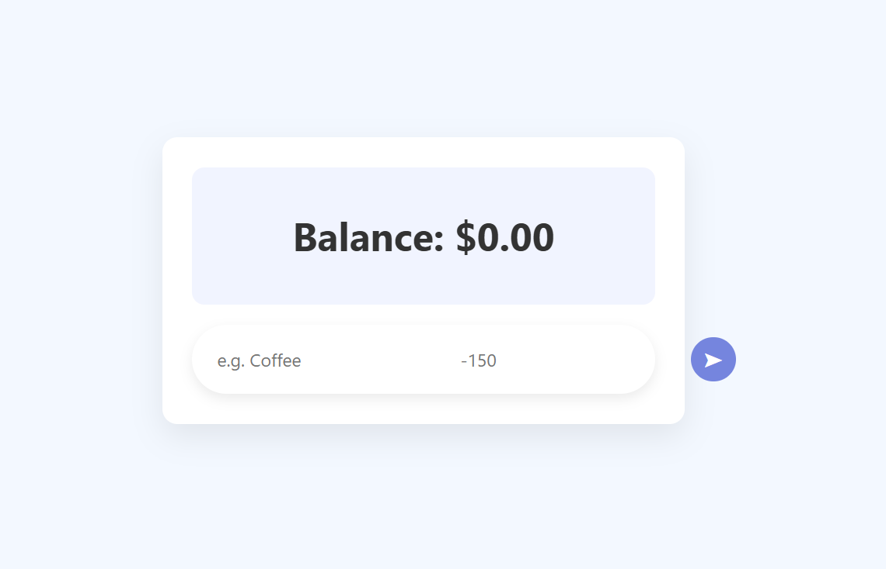
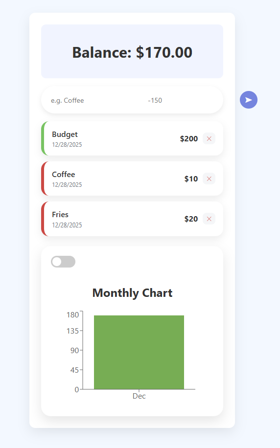

# 💸 Expense Tracker (React)

A simple and clean expense tracker built with React that allows users to add income and expenses, view their total balance, and manage transactions using a modern card-based UI.

---

## ✨ Features

- Add income and expense transactions  
- View total balance (calculated automatically)  
- List all transactions in clean cards  
- Delete transactions  
- Monthly breakdown of expenses  
- Responsive and modern UI  

---

## 🛠 Tech Stack

- React (Vite)
- JavaScript (ES6)
- CSS
- LocalStorage (optional)

---

## 🚀 Getting Started

### 1. Clone the repository
```bash
git clone https://github.com/VH9715/expense-tracker.git
```
### 2. Install dependencies
```bash
npm install
```
### 2. Run the app
```bash
npm run dev
```
Here is a screenshot of the app:



